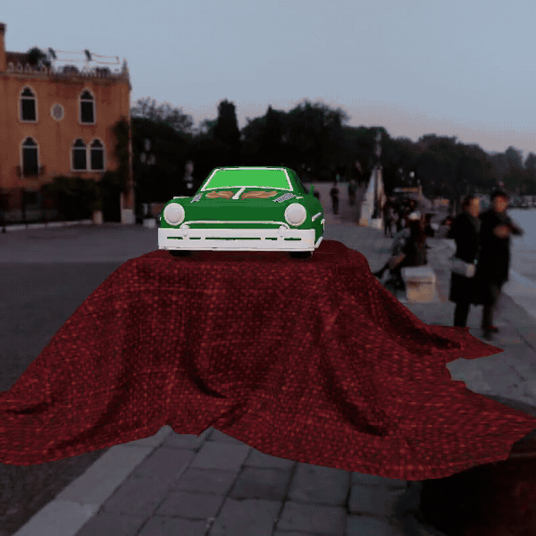
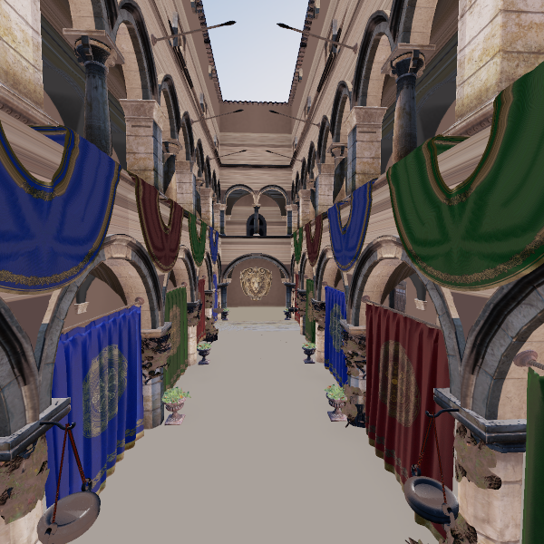
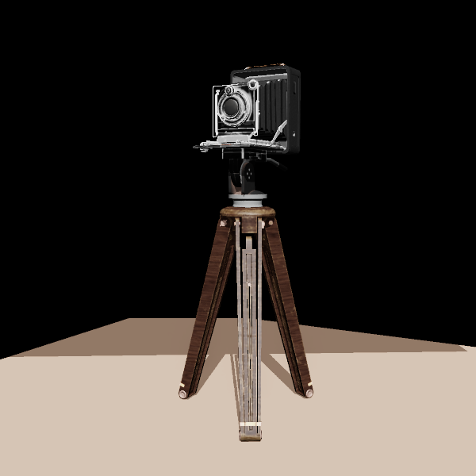
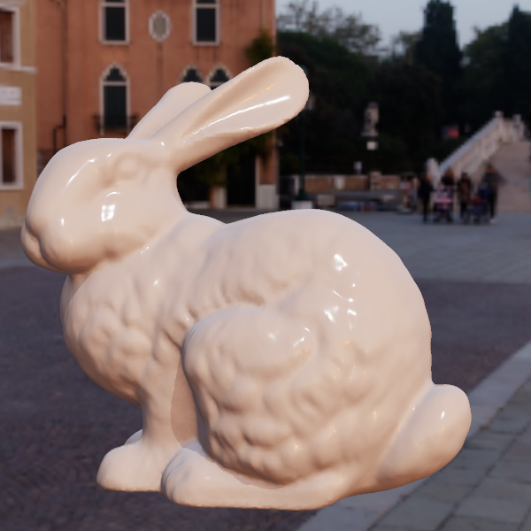
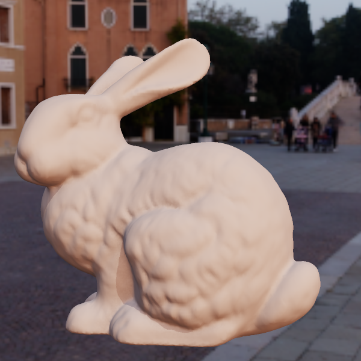
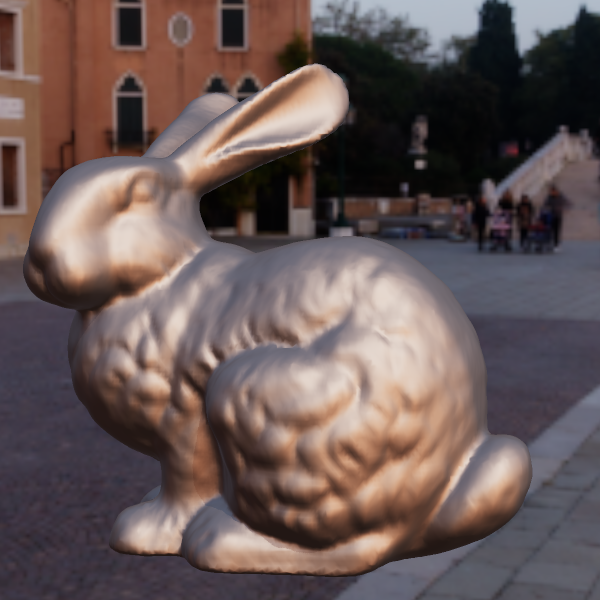
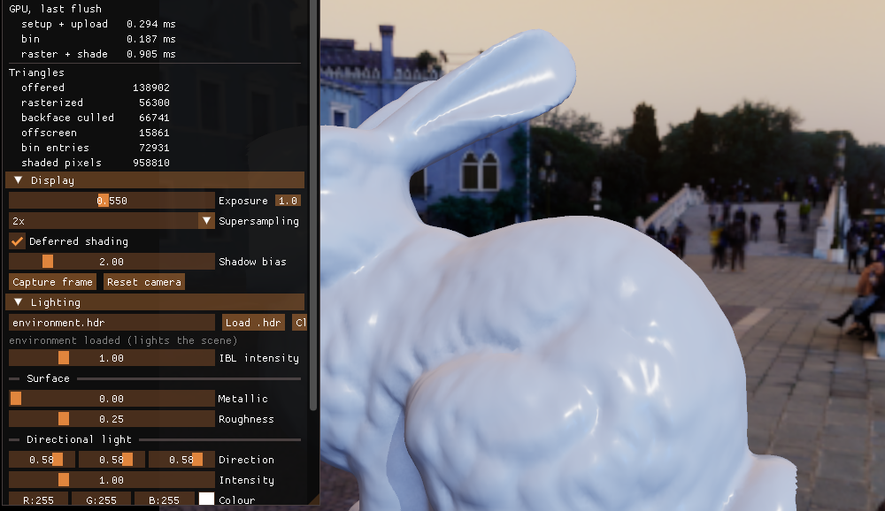
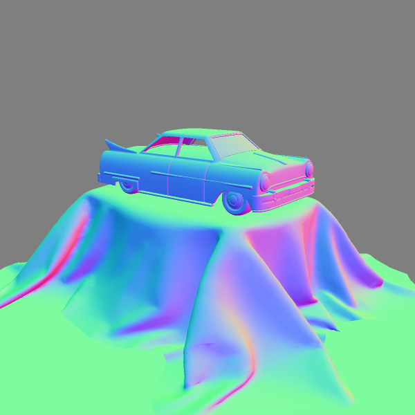

# CUDA Software Rasterizer

A real-time 3D renderer that runs the entire graphics pipeline in CUDA, with no external 
graphics API.

This means vertex transform, clipping, culling,
binning, rasterization, depth, shading, shadows, occlusion and tone mapping are
twenty-one hand-written kernels;

This project began as writing my own version of
[tinyrenderer](https://github.com/ssloy/tinyrenderer), which is just a CPU rasterizer in around 2025. Since then I rewrote it to be a GPU rasterizer and added some physically
based rendering techniques with image-based lighting and control panel.

(If you want to see more physics-based rendering techniques you should look at my [Physics-Based Rendering Engine](https://github.com/gracejinsotrue/PBRT-renderer-))



<sub>A turn around of a toy car under an HDR environment, and a material slide
from dielectric to metal and smooth to rough. </sub>



<sub>**Crytek Sponza:** 262,000+ triangles across 25 materials</sub>




<sub>**Khronos AntiqueCamera:** 20,000+ triangles across two scene-graph nodes on
a ground plane, with diffuse, object-space normal and specular maps.</sub>


## Features

- **Tiled binning:** the screen is cut into 16×16 tiles and each triangle is
  filed under the tiles it touches, so a block of threads only tests triangles
  that could cover its tile. Tile lists are sized by a prefix sum
  (`cub::DeviceScan::ExclusiveSum`)
- **Visibility-buffer deferred shading:**  This is done in two passes: 1. the pass records depth and the
  winning triangle in a single 64-bit `atomicMax` per pixel, 2. a second pass shades
  each covered pixel once, the point of this shading technique is to avoid slow shading with scenes with many overlapping objects
- **Physically based shading:** 1. microfacet BRDF with a GGX
  distribution 2. 3mith masking-shadowing, 3. fresnel and metallic-roughness
  parameters
- **Image-based lighting:** the scene is able to be lit with `.hdr` 
- **Persistent device geometry:** meshes are just uploaded once and re-transform on the
  GPU each frame, so only matrices cross the bus
- **Shadow mapping and SSAO (screenspace ambient occlusion)** that reconstructs
  eye-space position by inverting `Viewport * Projection` amd device-side
  supersampling
- **Dear ImGui control panel** with live per-stage GPU timing

## Materials

Same model, same view, same light. Only metallic and roughness change.

| smooth | rough |
|---|---|
|  |  |
| <sub>metallic 0, roughness 0.15</sub> | <sub>metallic 0, roughness 0.9</sub> |
|  |  |
| <sub>metallic 1, roughness 0.15</sub> | <sub>metallic 1, roughness 0.6</sub> |


## Control panel



Every setting is a widget and there exists live readout consisting of per-stage GPU times and triangle count

| | |
|---|---|
|  |  |

<sub>The panel may also show intermediate buffers like AO-term and eye-space normals. </sub>

## Built With

C++17, CUDA, [CUB](https://nvidia.github.io/cccl/cub/), SDL2, OpenGL and
[Dear ImGui](https://github.com/ocornut/imgui) (vendored under `third_party/`).

Bult with CMAKE, and there is also a plain Makefile in `src/` for WSL.

## Prerequisites

**Windows:** [CUDA Toolkit](https://developer.nvidia.com/cuda-downloads),
Visual Studio 2022, CMake ≥ 3.21, Ninja, and SDL2 through
[vcpkg](https://github.com/microsoft/vcpkg):

```
vcpkg install sdl2:x64-windows
set VCPKG_ROOT=C:\path\to\vcpkg
```

Configure and build from a Developer Command Prompt so nvcc can find `cl.exe`.
Use the Ninja generator, not the Visual Studio one.

**Linux:** the CUDA Toolkit, a C++17 toolchain, and:

```
sudo apt install libsdl2-dev cmake ninja-build
```

## Building

```
cmake --preset windows        # or --preset linux
cmake --build build/windows
build/windows/bin/unified_engine model.obj
```

Run the tests with:

```
ctest --test-dir build/windows --output-on-failure
```


