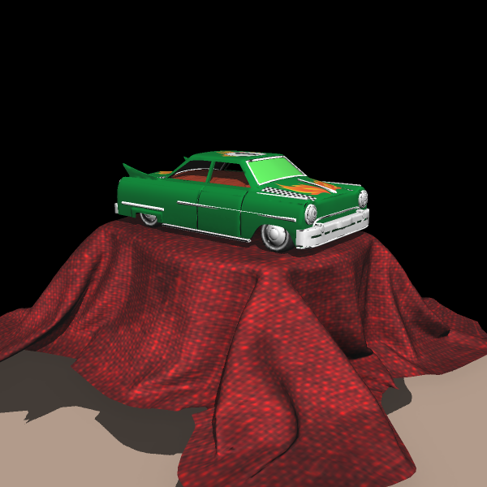
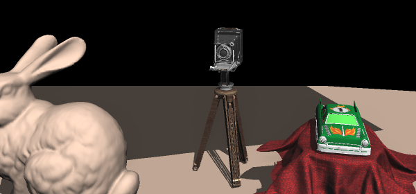
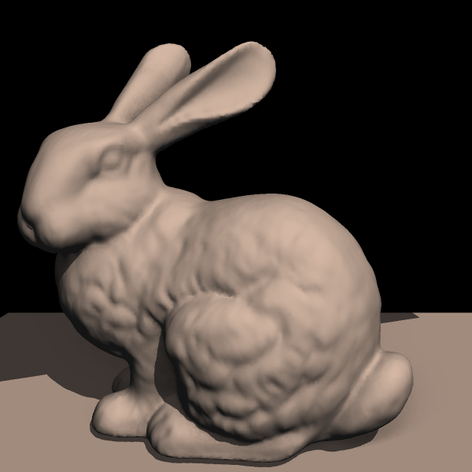
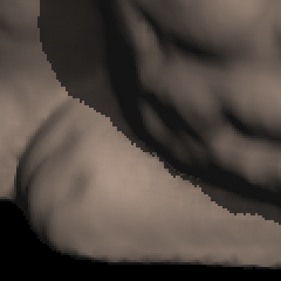
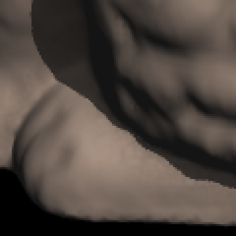

# CUDA software rasterizer

A 3D renderer that does all the beautiful graphics rendering and math with CUDA and no external graphics API. 


In 2025 wrote my own version of [tinyrenderer](https://github.com/ssloy/tinyrenderer)
CPU rasterizer, and since 2026 I've rewritten what I can in CUDA which is the current product now.

| | |
|---|---|
|  |  |
| 4 meshes, 110,984 triangles. | 3 meshes, 22,114 triangles. |



<sub>All three subjects in one frame consisting of 200,501 triangles.</sub>

Crytek Sponza, 262,267 triangles across 25 materials


For physically accurate rendersof objects and scenes, you should check out my  
physically-based ray tracer: https://github.com/gracejinsotrue/PBRT-renderer-

---

## What it does

- Tiled rasterization: the screen is cut into 16×16 tiles and each triangle
  is filed under the tiles it touches, so a block of threads working one tile
  only tests triangles that could cover it. Tile lists are sized by prefix sum
  (`cub::DeviceScan::ExclusiveSum`) 
- Deferred shading, there exists a 1.visibility pass that saves depth and the winning triangle
  index into a single 64-bit `atomicMax` per pixel, then a 2. second pass to shade
  each covered pixel once, so shading cost tracks screen area rather
  than how many surfaces may be stacked behind each other.
- Geometry on GPU: Meshes upload once and re-transform on the
  device each frame, so only matrices cross the bus
- Shading: Diffuse, specula, object-space normal maps,
  directional light, perspective-correct interpolation
- Shadow mapping 
- SSAO (sceenspace ambient occlusion), this is just reconstructing eye-space positions from
  the depth buffer by inverting `Viewport * Projection` matrices
- Supersampling resolved on the device
- A scene graph for multiple objects at once


## Pictures


Stanford bunny! 69,451 triangles and no textures, so what shows is
interpolated normals and the shadow pass. The next two figures crop into this
same view.




Supersampling at 1× and 2×, it basicaly crops on the silhouette and magnified to the 
nearest-neighbor

| 1× | 2× |
|---|---|
|  |  |


| AO term | eye-space normals |
|---|---|
|  |  |

## Build and run

Needs CUDA, SDL2 and CMake ≥ 3.21.

```
cmake --preset windows        # or --preset linux
cmake --build build/windows
build/windows/bin/unified_engine model.obj
```

On Windows, run from a Developer Command Prompt so nvcc can find `cl.exe`, and
install SDL2 with `vcpkg install sdl2:x64-windows` with `VCPKG_ROOT` set. On
Linux, `apt install libsdl2-dev ninja-build`.


