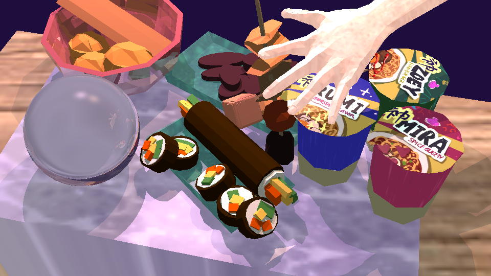

A 3D renderer written from scratch. The whole pipeline is my own CUDA kernels --
no OpenGL, DirectX or Vulkan draws a triangle here. Started in 2025 as a CPU
rasterizer following ssloy's
[tinyrenderer](https://schmittl.github.io/tinyrenderer/), moved to the GPU in
2026.

# BUILD

Needs a CUDA-capable GPU, the CUDA toolkit, and SDL2.

    cmake --preset windows          # or: --preset linux
    cmake --build build/windows
    ctest --test-dir build/windows

Linux: `sudo apt install libsdl2-dev`. Windows: build from a Developer Command
Prompt so nvcc finds `cl.exe`, and get SDL2 from `vcpkg install sdl2:x64-windows`.

# FEATURES

- Tiled rasterization: one kernel transforms and culls the scene, triangles are
  binned into 16x16 tiles, one block per tile rasterizes them.
- Deferred shading through a visibility buffer: the raster pass records which
  triangle won each pixel (depth and triangle index in one 64-bit atomic) and a
  second pass shades once per pixel instead of once per surviving fragment.
  Forward shading is still there and switchable, because that is what the
  deferred path is measured against.
- Scene graph with parent-child transforms.
- Two-pass shadow mapping, Phong shading with diffuse/normal/specular maps.
- SSAO.
- 1x/2x/4x supersampling.
- Differential tests against the old CPU rasterizer in `src/tests/`.
- Frame presents through CUDA/OpenGL interop, never touching the host.
- Per-kernel timing via CUDA events, plus an Nsight Systems script.

Measurements are in [NOTES.md](NOTES.md).

# IMAGES

Food scene from kpop demon hunters

All the models are made by hand, here is how I did the modelling.

https://github.com/user-attachments/assets/91802893-dd5c-45fb-9a43-e0ee252d52d3

Engine screenshot

https://github.com/user-attachments/assets/a302a7f6-5d5b-45d6-b2bc-8536bedeb28e

https://github.com/user-attachments/assets/7ff0dcd0-e98a-43ae-a273-07f3e8cb663c

"that's gore of my comfort character"
e.g. funny bugs

like any 3d engine, at certain angles, the geometry will look very weird.

Bro the way I learned Blender from scratch for this too:

